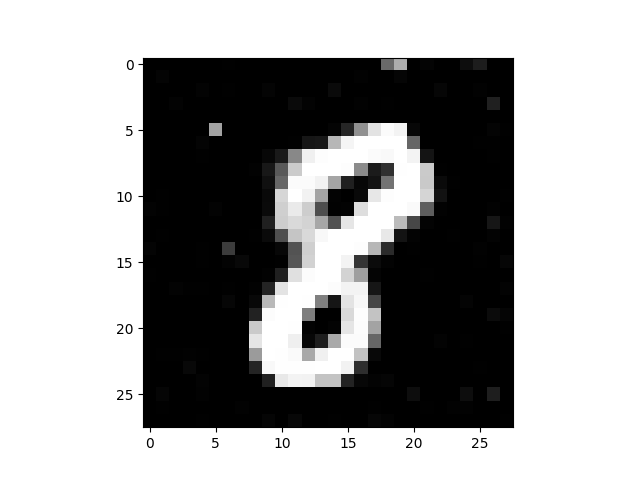
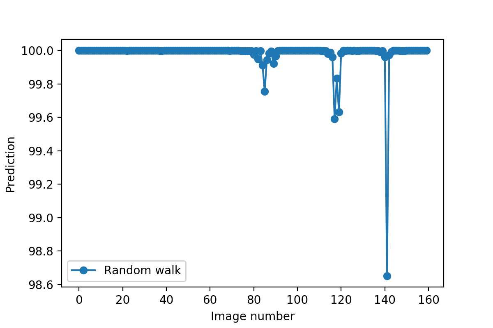
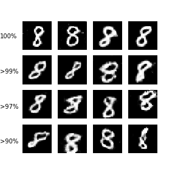
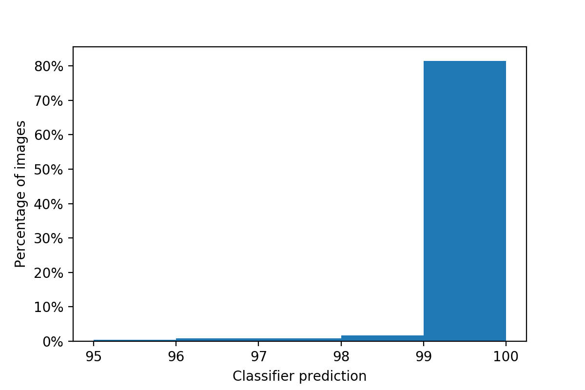
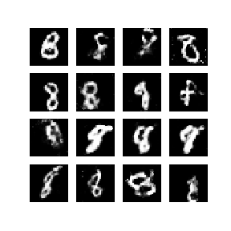
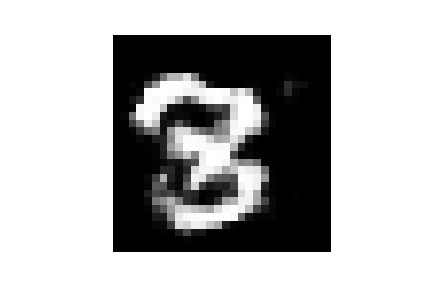
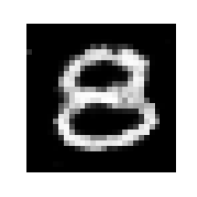

# Verification of Neural Networks: Specifying Global Robustness using Generative Models


<br><br>

### [Project](https://github.com/mohitiitb/NeuralNetworkVerification_GlobalRobustness) | [arXiv](https://arxiv.org/abs/1910.05018)

We present experiments exploring the notions of global correctness and global robustness defined in our research paper:

[Nathanaël Fijalkow](https://nathanael-fijalkow.github.io/) and Mohit Kumar Gupta


The experiments are in Jupter notebook format:
* [Random walk](https://github.com/mohitiitb/NeuralNetworkVerification_GlobalRobustness/blob/master/Random%20walk.ipynb)
* [Analysis of an image classifier using a generative model](https://github.com/mohitiitb/NeuralNetworkVerification_GlobalRobustness/blob/master/Analysis.ipynb)
* [Evaluating the global correctness](https://github.com/mohitiitb/NeuralNetworkVerification_GlobalRobustness/blob/master/Global%20correctness.ipynb)
* [Searching for Realistic Adversarial Examples: black-box approach](https://github.com/mohitiitb/NeuralNetworkVerification_GlobalRobustness/blob/master/Adversarial%20Examples%20Black-box.ipynb)
* [Searching for Realistic Adversarial Examples: white-box approach](https://github.com/mohitiitb/NeuralNetworkVerification_GlobalRobustness/blob/master/Adversarial%20Examples%20White-box.ipynb)
* [Dependence on the generative model: disjoint training sets](https://github.com/mohitiitb/NeuralNetworkVerification_GlobalRobustness/blob/master/EMNIST.ipynb)

All experiments use Tensorflow, and pre-trained models can be used (see /Models).

## Random Walk results

- Images generated in a random walk:
<p align='center'>  
    
</p>

- Confidence score for images generated in a random walk:
<p align='center'>  
    
</p>


## Analysis of an image classifier using a generative model

- Classifier confidence score with images:
<p align='center'>  
    
</p>

- Prediction accuracy (of the image classifer) across the generated images:
<p align='center'>  
   
  <br>
  <li align='center'> Percentage of images with > 90% prediction: 86.84 % </li>
  <li align='center'> Percentage of images with > 97% prediction: 83.95 % </li>
  <li align='center'> Percentage of images with > 99% prediction: 81.49 % </li>
</p>

## Evaluating the Global Correctness
- Outliers (generated during evaluation):
<p align='center'>  
    
</p>

## Searching for realistic adversarial examples: White box approach
<p align='center'>  
    
</p>


## Searching for realistic adversarial examples: Black box approach
<p align='center'>  
    
</p>

## Prerequisites
- Linux or macOS
- Python 3/2
- Tensorflow

## Getting Started
### Installation
- Install python libraries [tensorflow](https://github.com/tensorflow/tensorflow) and numpy.
```bash
pip3 install tensorflow numpy
```
- Install Jupyter Notebook 
```bash
pip3 install jupyter
```

- Clone this repo:

```bash
git clone https://github.com/mohitiitb/NeuralNetworkVerification_GlobalRobustness.git
cd NeuralNetworkVerification_GlobalRobustness
```
### Testing 

- All experiments use pre-trained models (see /Models).

- To generate/train a classifier (optional)
```bash
python3 train_classifer.py
```
- To generate/train a GAN (optional)
```bash
python3 train_gan.py
```
- Go through the jupyter notebooks they are self explanatory and easy to run.

### Datasets

- [MNIST](http://yann.lecun.com/exdb/mnist/)
- [Extended MNIST](https://arxiv.org/abs/1702.05373)
- [Fashion MNIST](https://github.com/zalandoresearch/fashion-mnist)

